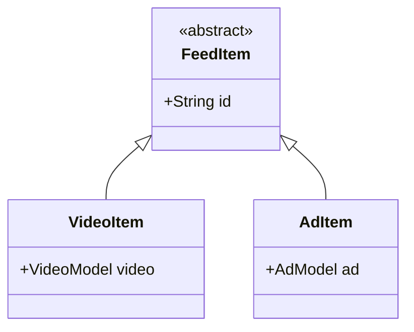

# Kế hoạch triển khai: Sprint 7 (Đã cập nhật theo phản hồi)

Kế hoạch này tích hợp các đề xuất cải tiến về kiến trúc mã nguồn (`FeedItem` cho video/ads), cấu hình và mở rộng chiến dịch Đà Lạt, làm rõ thuật ngữ bản quyền, và bổ sung lưu trữ dữ liệu hiệu quả chiến dịch (Analytics).

---

## 1. Giao Diện Sáng/Tối (Light/Dark Theme)

### Mục Tiêu
Cung cấp tùy chọn chuyển đổi giao diện trong Cài đặt với các nhãn icon trực quan:
*   `☀️ Sáng` (ThemeMode.light)
*   `🌙 Tối` (ThemeMode.dark)
*   `⚙️ Hệ thống` (ThemeMode.system)

### Sơ Đồ Cấu Trúc
```
[Setting Screen] ──> [Theme Dialog] ──> [SharedPreferences]
                                               │
                                       (themeModeProvider)
                                               │
                                               ▼
                                         [MaterialApp]
```

### Triển Khai
*   **Settings Screen**: Thay đổi danh sách chọn trong BottomSheet/Dialog hiển thị đúng 3 option đi kèm icon tương ứng.
*   **Giao diện Sáng (`AppTheme.lightTheme`)**: 
    *   Giữ tông màu thương hiệu chính: TikTok Red (`#FE2C55`).
    *   Màu nền: `#F8F8F8` (Light Grey).
    *   Màu thẻ/bảng biểu: `#FFFFFF` (White).
    *   Màu chữ chính: `#161722` (Dark Grey/Black).
    *   Màu phân tách (divider): `#E3E3E4`.

---

## 2. Quảng Cáo Video Tự Động & Kiến Trúc `FeedItem`

### Mục Tiêu
Cải tiến danh sách feed sử dụng kiểu dữ liệu trừu tượng `FeedItem` giúp phân tách sạch sẽ giữa video thông thường và video quảng cáo được tài trợ, hiển thị giao diện tùy chỉnh và tích hợp liên kết ngoài qua `url_launcher`.

### Sơ Đồ Kiến Trúc Lớp (Class Architecture)


### Chi Tiết Triển Khai

#### [NEW] [feed_item.dart](file:///d:/University/Mobile_Application/TopTop/toptop_flutter/lib/features/video_feed/models/feed_item.dart)
```dart
abstract class FeedItem {
  final String id;
  FeedItem(this.id);
}

class VideoItem extends FeedItem {
  final VideoModel video;
  VideoItem(this.video) : super(video.videoId);
}

class AdItem extends FeedItem {
  final AdModel ad;
  AdItem(this.ad) : super(ad.adId);
}
```

#### [NEW] [ad_model.dart](file:///d:/University/Mobile_Application/TopTop/toptop_flutter/lib/features/video_feed/models/ad_model.dart)
Model chứa thông tin quảng cáo:
*   `adId` (String)
*   `videoUri` (String)
*   `sponsorName` (String)
*   `description` (String)
*   `ctaText` (String): Nút kêu gọi hành động (ví dụ: "Tìm hiểu thêm", "Đặt tour ngay").
*   `targetUrl` (String): Link trang web của nhà tài trợ.

#### [MODIFY] [video_provider.dart](file:///d:/University/Mobile_Application/TopTop/toptop_flutter/lib/features/video_feed/providers/video_provider.dart)
*   Tạo provider `homeFeedProvider` có chức năng tải cả video đề cử và danh sách quảng cáo.
*   Trộn danh sách: Cứ sau mỗi **5 video thường** (`VideoItem`) sẽ tự động chèn **1 video quảng cáo** (`AdItem`).

#### [MODIFY] [video_feed_screen.dart](file:///d:/University/Mobile_Application/TopTop/toptop_flutter/lib/features/video_feed/screens/video_feed_screen.dart)
*   Tại `PageView.builder`, kiểm tra kiểu dữ liệu:
    ```dart
    final item = feedItems[index];
    if (item is AdItem) {
      return AdPlayerWidget(ad: item.ad); // Hiển thị giao diện Tài trợ + CTA
    } else if (item is VideoItem) {
      return VideoPlayerWidget(video: item.video); // Video thường
    }
    ```
*   Nút CTA trên `AdPlayerWidget` sử dụng thư viện `url_launcher` để kích hoạt trình duyệt ngoài qua lệnh `launchUrl(Uri.parse(ad.targetUrl))`.

---

## 3. Quảng Bá Du Lịch Đà Lạt & Theo Dõi Hiệu Quả (Analytics)

### Mục Tiêu
Hỗ trợ truyền thông và theo dõi thống kê lượt xem/click dành riêng cho chiến dịch quảng bá địa danh Đà Lạt.

### Cập Nhật Model & Dữ Liệu

#### [MODIFY] [video_model.dart](file:///d:/University/Mobile_Application/TopTop/toptop_flutter/lib/features/video_feed/models/video_model.dart)
Thêm trường địa điểm tùy chọn:
*   `String? location;` (ví dụ: `location = "Da Lat"`)

#### Logic Sắp Xếp Độ Ưu Tiên (Ranking Boost)
Thay vì hardcode từ khóa đơn lẻ, cấu hình danh sách hashtag chiến dịch:
```dart
const campaignTags = [
  "#dalat",
  "#dalatdulich",
  "#khamphadalat"
];
```
Trong `watchRecommendedVideos()`, video nào có `location == "Da Lat"` hoặc chứa một trong các `campaignTags` trong mảng `hashtags` sẽ được ưu tiên hiển thị trước (hoặc có trọng số xuất hiện cao hơn).

#### Đo Lường Thống Kê (`campaign_analytics` Collection)
Tạo collection riêng biệt `campaign_analytics` lưu trữ hiệu quả các video tham gia chiến dịch quảng bá Đà Lạt:
*   `Document ID`: `videoId`
*   Cấu trúc dữ liệu:
    ```json
    {
      "videoId": "...",
      "campaign": "dalat",
      "views": 105,
      "clicks": 18
    }
    ```
*   **Views**: Tăng khi người dùng lướt và xem video Đà Lạt quá 3 giây.
*   **Clicks**: Tăng khi người dùng bấm vào hashtag hoặc badge của chiến dịch để tìm hiểu.

#### Giao Diện Tìm Kiếm
*   Banner nổi bật tại [search_screen.dart](file:///d:/University/Mobile_Application/TopTop/toptop_flutter/lib/features/search/screens/search_screen.dart): **"Đà Lạt Trong Tôi - Khám Phá Xứ Sở Sương Mù"**.
*   Các video thuộc chiến dịch Đà Lạt hiển thị kèm thẻ Badge nhỏ: **"🌲 Du Lịch Đà Lạt"**.

---

## 4. Quyền Riêng Tư & Báo Cáo Bản Quyền (Copyright)

### Mục Tiêu
Hỗ trợ bảo vệ tác quyền số và cấu hình báo cáo vi phạm thực tế hơn, tránh các tuyên bố không khả thi về việc chặn re-upload tuyệt đối.

### Thuộc Tính Metadata
Video được gán các thuộc tính bảo mật lưu trên Firestore:
*   `allowDownload` (bool, mặc định `true`)
*   `allowDuet` (bool, mặc định `true`)
*   `isCopyrightProtected` (bool, mặc định `false`): Gắn nhãn *"Hỗ trợ phát hiện và báo cáo vi phạm bản quyền"*.

### Cài Đặt Quyền Riêng Tư
*   Trong màn hình [video_description_screen.dart](file:///d:/University/Mobile_Application/TopTop/toptop_flutter/lib/features/video_upload/screens/video_description_screen.dart), bổ sung các switch:
    *   *Cho phép người khác tải xuống video này*
    *   *Kích hoạt bảo vệ bản quyền & báo cáo vi phạm*

### Thực Thi Quyền Hạn
*   Trong [video_action_bar.dart](file:///d:/University/Mobile_Application/TopTop/toptop_flutter/lib/features/video_feed/widgets/video_action_bar.dart) (Share sheet):
    *   Nếu `allowDownload == false`: Ẩn nút Tải xuống hoặc nếu người dùng click vào, hiển thị thông báo SnackBar/Toast: **"Tác giả đã tắt tính năng tải xuống cho video này."**
*   Hệ thống báo cáo tích hợp lý do báo cáo vi phạm bản quyền mới: **`COPYRIGHT_CLAIM`**.
*   Nếu một video bị quản trị viên gỡ bỏ hoặc bị báo cáo vi phạm bản quyền, một thông báo cảnh báo vi phạm sẽ được gửi tới tác giả qua Realtime Database `/Notifications`, hỗ trợ quy trình kháng cáo (Appeals) đã xây dựng ở Sprint 6.

---

## 5. Đồng Bộ Ngày Sinh & Chia Sẻ Trang Cá Nhân

### Mục Tiêu
Bổ sung các chi tiết còn thiếu trong quá trình di chuyển chức năng hồ sơ (Profile) từ Java sang Flutter:
1.  **Đồng bộ dữ liệu ngày sinh (birthdate)** từ Firestore vào `ProfileModel` để hiển thị trên màn hình Chỉnh sửa hồ sơ (`EditProfileScreen`) và tự động điền sẵn (prefill) trong màn hình nhập liệu (`EditFieldScreen`).
2.  **Chức năng chia sẻ trang cá nhân (Share Profile)**: Sao chép liên kết trang cá nhân (dạng `http://toptoptoptop.com/<username>`) vào clipboard khi nhấn nút chia sẻ.

### Chi Tiết Triển Khai

#### [MODIFY] [profile_model.dart](file:///d:/University/Mobile_Application/TopTop/toptop_flutter/lib/features/auth/models/profile_model.dart)
*   Thêm trường `birthdate` (String) vào `ProfileModel`.
*   Cập nhật `ProfileModel.fromMap`, `toMap` và `copyWith` để xử lý trường `birthdate`.

#### [MODIFY] [edit_profile_screen.dart](file:///d:/University/Mobile_Application/TopTop/toptop_flutter/lib/features/profile/screens/edit_profile_screen.dart)
*   Thay đổi hiển thị ngày sinh tĩnh từ `'Chưa cập nhật'` thành `profile.birthdate.isNotEmpty ? profile.birthdate : 'Chưa cập nhật'`.

#### [MODIFY] [edit_field_screen.dart](file:///d:/University/Mobile_Application/TopTop/toptop_flutter/lib/features/profile/screens/edit_field_screen.dart)
*   Trong `initState()`, khi kiểm tra trường là `birthdate`, lấy ngày sinh hiện tại từ profile để gán cho `_controller.text`.

#### [MODIFY] [profile_screen.dart](file:///d:/University/Mobile_Application/TopTop/toptop_flutter/lib/features/profile/screens/profile_screen.dart)
*   Nhập thư viện `package:flutter/services.dart` để sử dụng `Clipboard`.
*   Thêm biểu tượng Chia sẻ (`Icons.share`) vào phần `actions` của `AppBar`.
*   Khi người dùng nhấn vào nút chia sẻ, lưu link `"http://toptoptoptop.com/${profile.username}"` vào clipboard và hiển thị SnackBar thông báo thành công.

---

## Kế Hoạch Xác Minh (Verification Plan)

### Thư Viện Cần Thêm (`pubspec.yaml`)
*   `url_launcher: ^6.2.5`

### Các Bước Xác Minh Thủ Công
1.  **Test Giao Diện**: Đổi theme trong Settings -> Kiểm tra độ tương phản và màu sắc Light/Dark Mode theo 3 tùy chọn sáng, tối, hệ thống.
2.  **Test Quảng Cáo**: Lướt feed để kiểm tra xem video quảng cáo có hiển thị sau mỗi 5 video thường hay không, nhấp nút CTA xem có mở trình duyệt ngoài (`url_launcher`) thành công không.
3.  **Test Chiến Dịch Đà Lạt**: Upload video mới với vị trí "Da Lat" và hashtag `#dalat` -> kiểm tra tăng views trong bảng `campaign_analytics`.
4.  **Test Bản Quyền**: Thiết lập `allowDownload = false` khi upload và xác nhận nút download trên tài khoản khác bị vô hiệu hóa/thông báo chặn tải xuống thành công.
5.  **Test Ngày Sinh**: Chỉnh sửa ngày sinh trong hồ sơ, kiểm tra xem nó lưu thành công lên Firestore và hiển thị lại chính xác trên màn hình hồ sơ, khi mở lại màn hình chỉnh sửa ngày sinh phải hiển thị đúng ngày sinh cũ.
6.  **Test Chia Sẻ**: Nhấn biểu tượng chia sẻ trên profile, kiểm tra xem liên kết đã được lưu vào clipboard đúng định dạng và có SnackBar hiển thị thành công.
